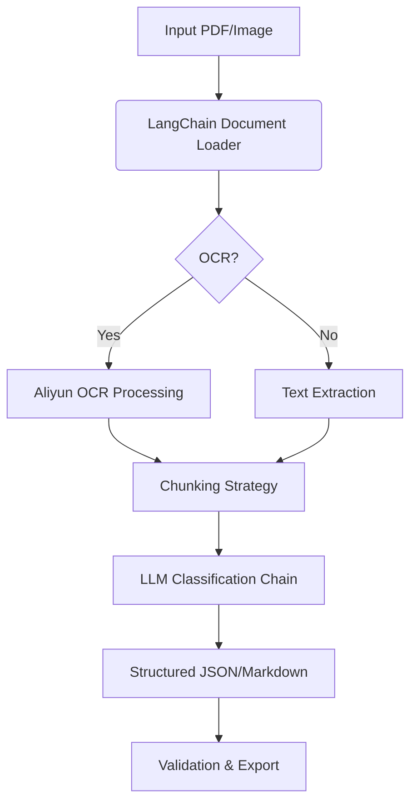

# QuizExtractor - Automated Quiz Content Extraction with LangChain & LLMs
### 📌 AI-Powered Pipeline for Structured Quiz/Exam Content Extraction

QuizExtractor is a LangChain-based document intelligence system that automatically parses, analyzes, and structures assessment content from PDFs, images, or scans using cutting-edge LLMs. Designed for educators, content creators, and EdTech platforms needing scalable quiz digitization.

## ✨ Core Capabilities
### LangChain Processing Pipeline
* Smart Document Ingestion
  * Unified loader for PDFs (PyPDFLoader), images (OCR via Tesseract), and text
  * Adaptive text splitting with RecursiveCharacterTextSplitter for LLM context optimization

* LLM-Powered Classification
  * Custom chains for:
  * Question/Answer detection
  * Metadata tagging (question type, difficulty, topic)
  * Context-aware answer key matching

* Multi-Model Support
  * OpenAI GPT-4o (optimized for accuracy)
  * Claude 3 (strong in long-form content)
  * Local models via Ollama (Llama 3, Mistral)
  * Structured Outputs

### Structured Outputs
```json
{
  "question": "What is the capital of France?",
  "type": "multiple_choice",
  "options": ["London", "Paris", "Berlin", "Tokyo"],
  "answer": "Paris",
  "metadata": {
    "topic": "Geography",
    "difficulty": "easy"
  }
}
```

## 🛠️ Technical Architecture


## 🚀 Quick Deployment
```bash
# With OpenAI (requires API key)
quizextractor process --input exam.pdf --model gpt-4

# With local Llama 3
ollama pull llama3
quizextractor process --input scanned_quiz.jpg --model ollama/llama3
```

## 📊 Benchmark Results

| metric       | GPT-4 | Claude3 | DeepSeek |
|--------------|-------|---------|----------|
| Q&A Accuracy | 92%   | 89%     | 85%      |
| Speed        | 4.2   | 3.8     | 2.1      |
| cost         | $3.20 | $2.90   | $0.15    |

## 💡 Ideal Use Cases
* Publishers: Convert textbook exercises into digital question banks
* LMS Platforms: Auto-ingest legacy exam materials
* Teachers: Generate practice tests from past papers
```python
# Sample integration
from quizextractor import process_exam

results = process_exam(
    file_path="final_exam.pdf",
    output_format="json",
    model_config={"provider": "openai", "model": "gpt-4-turbo"}
)
```